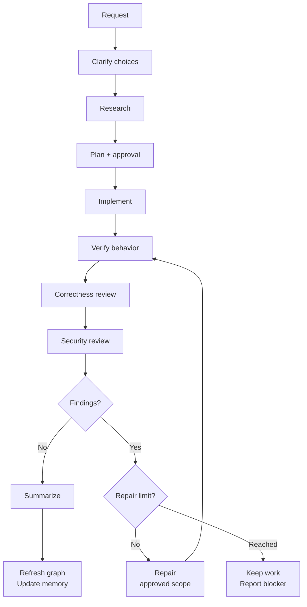
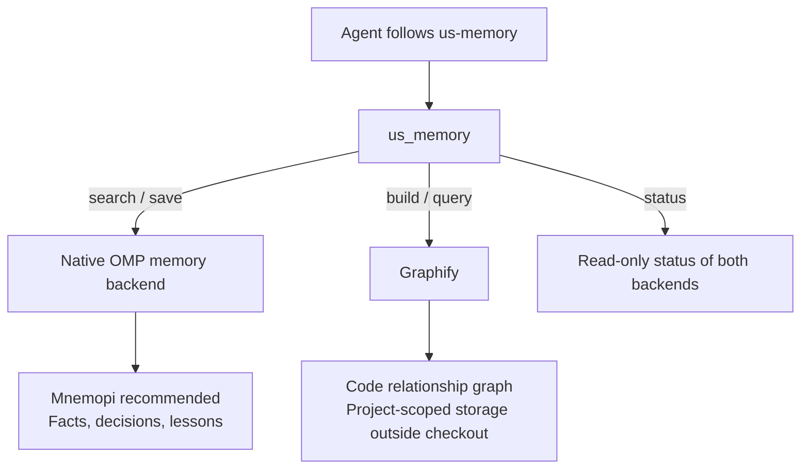

# Useful Skills for Oh My Pi

**From a natural-language request to reviewed, verified work.**

Owned `us-*` skills for development, focused audits, delivery, and project memory. OMP discovers their descriptions; the model follows the relevant instructions using native tools and workers.

| Develop | Inspect | Deliver | Remember |
| --- | --- | --- | --- |
| Clarify, research, approve, implement, review | Focused security, performance, and quality audits | Explicitly authorized PR or direct-main delivery | Durable facts alongside code relationships |

**Start here:** [Installation](#installation) · [Workflow & skills](#skill-led-development) · [Model configuration](#native-model-configuration) · [Memory](#agent-invoked-memory)

**Reference:** [Management](#management-and-optional-library) · [Audits & delivery](#focused-audits-and-delivery) · [Updates](#updates-and-releases) · [Development](#development-and-verification) · [Attribution](#attribution)

No Anvil dependency, custom workflow executor, model router, phase database, or stop-hook continuation loop.

## Installation

Requires OMP with marketplace support and Node.js **22+**. No npm dependencies or build step.

```bash
omp plugin marketplace add MSpiechowicz/oh-my-pi-useful-skills
omp plugin install oh-my-pi-useful-skills@omp-useful-skills --scope user
```

Restart OMP after installation or update. Use `--scope project` for a project installation, or pass `--profile NAME` to both commands for an isolated profile. Plugin identity remains `oh-my-pi-useful-skills@omp-useful-skills`.

For local development, load the **package directory**, not the extension file alone:

```bash
omp -e /absolute/path/to/oh-my-pi-useful-skills
```

`./useful-skills install [--scope user|project] [--profile NAME]` installs the published marketplace plugin, not the checkout itself. Source checkouts are updated with `git pull --ff-only`; the updater never overwrites them.

## Skill-led development

Ask naturally: “I want to build a rocket simulator.” `us-workflow` guides the following development flow. Precise requests can require zero clarification questions. Small changes scale the depth without omitting research, reviews, or memory.



Verification failures return to implementation. Repairs repeat verification and **both** reviews. Three unsuccessful repair rounds or repeated no progress stop the loop; memory failures prevent claiming the full workflow complete. Publication is a separate, explicitly authorized action—not the next automatic step.

The parent owns the objective, native todo list, plan, acceptance, and integration. Research uses a read-only worker. Independent ready work uses native parallel `task` calls with disjoint ownership; shared files and real dependencies stay serial. Existing session plans/transcripts support interruption recovery.

These are prompt instructions, **not enforced stage transitions**. They cannot guarantee model compliance. Ordinary explanations and explicitly focused audits do not start the full development workflow. Plan approval does not authorize publication.

| Skill | Selection and responsibility |
| --- | --- |
| `us-workflow` | Natural build/fix/change/refactor requests; composes the development flow |
| `us-grill-me` | Consequential unresolved product/engineering choices; inspect before asking |
| `us-research` | Current code, callers, conventions, documentation, and memory before planning |
| `us-plan` | Concrete acceptance, interfaces, ownership, verification, and one approval |
| `us-implement` | Approved implementation and in-scope repair; native independent workers |
| `us-review` | Fresh evidence-based correctness review against acceptance |
| `us-memory` | Automatic research recall and verified-completion graph/fact updates |
| `us-concise` | Caveman-lite context/prose guidance; preserves technical meaning and exact text |
| `us-check-security` | Read-only trust-boundary audit or post-correctness security review |
| `us-check-performance` | Measured representative performance audit, not speculative optimization |
| `us-check-code-quality` | Evidence-backed cohesion/duplication audit and explicit guidance merge |
| `us-improve-codebase-architecture` | Read-only architectural opportunities, then approved focused refactoring |
| `us-improve-code-coverage` | Measured coverage gaps, then approved behavior-focused test improvements |
| `us-ship-backlog-item` | One item, isolated feature branch, reviewed linked PR, and Done only after confirmed merge |
| `us-open-pr` | Explicitly authorized reviewed feature-branch PR delivery |
| `us-approve-work` | Explicitly authorized commit and fast-forward direct push to `main` |
| `us-library` | Explicit, bounded consultation of optional ECC reference material |

Direct invocation uses OMP's actual syntax:

```text
/skill:us-check-security
/skill:us-check-performance
/skill:us-check-code-quality
/skill:us-improve-codebase-architecture
/skill:us-improve-code-coverage
/skill:us-ship-backlog-item
/skill:us-open-pr
/skill:us-approve-work
```

No extension-command wrapper is installed for each skill. Add a matching `skills/us-example/SKILL.md` with a concrete single-line frontmatter `description`; native shallow discovery and the catalog need no JavaScript registry update. Keep substantial checklists/worker briefs in skill-local references linked through `skill://us-<name>`.

## Native model configuration

Useful Skills does not add a model router or agent catalog. Configure OMP's native role aliases in the active profile/global config—normally `~/.omp/agent/config.yml`; use `omp config path` if the active profile relocates that directory. A repository can override them in `<repo>/.omp/config.yml`. Project settings override global settings; CLI overlays and runtime options override both.

Open `/model`, then the **Roles** view, to assign and persist role mappings. This example uses only OpenAI Codex selectors; availability depends on your OMP model catalog and credentials, not on this table.

| Role | Native task agent | Example model |
| --- | --- | --- |
| `research` | `scout` | `openai-codex/gpt-5.6-luna:xhigh` |
| `implementation` | `task` | `openai-codex/gpt-5.6-terra:high` |
| `review` | `reviewer` | `openai-codex/gpt-6-astra:medium` |
| `security` | `security-reviewer` | `openai-codex/gpt-5.6-sol:high` |
| `plan` | Parent-owned planning; no worker agent | `openai-codex/gpt-6-astra:high` |

```yaml
modelRoles:
  research: openai-codex/gpt-5.6-luna:xhigh
  implementation: openai-codex/gpt-5.6-terra:high
  review: openai-codex/gpt-6-astra:medium
  security: openai-codex/gpt-5.6-sol:high
  plan: openai-codex/gpt-6-astra:high

task:
  agentModelOverrides:
    scout: "@research"
    task: "@implementation"
    reviewer: "@review"
    security-reviewer: "@security"
```

Native `task` dispatch selects an **agent type**, not a model. For a dispatched agent, model selection is `task.agentModelOverrides` first, then that agent's `model` frontmatter, then OMP's native fallback (the parent’s active model and its configured/default fallback). Role aliases such as `@review` resolve through `modelRoles`. If a mapping is absent, preserve native fallback and report the limitation—do not edit user configuration automatically.

Planning remains parent-owned: the `plan` role configures planning, but it has no native task-agent mapping, and loading `us-plan` does not switch the session model. See [Native model routing](skills/us-workflow/SKILL.md#native-model-routing) for the shared workflow guidance; loading that guidance does not launch the workflow.

## Management and optional library

```text
/useful-skills list [query]
/useful-skills doctor
/useful-skills library list [skills|commands|agents|rules] [query]
/useful-skills update check
/useful-skills update install
```

The terminal launcher supports the same catalog/update operations, plus `install` and `help`. `/ecc`, `/ecc-doctor`, and `/ecc-memory` aliases are removed. OMP's native `/memory` remains unchanged.

Broad ECC skills, commands, agents, rules, and supporting files live under `skills/us-library/references/ecc/`. They are **not active skills, injected rules, or native worker overrides**. On an explicit library request, the agent reads only relevant references, for example `skill://us-library/references/ecc/skills/security-audit/SKILL.md`, and translates useful guidance into owned/native conventions. It must not activate legacy workflows or another harness.

The extension adds one short discovery hint, retains independent catastrophic-command protection and common secret-pattern output redaction, and performs quiet read-only update checks. Opening a session never starts a model workflow, dispatches workers, builds memory, or reviews code. `OMP_ECC_SAFETY=off` remains the existing catastrophic-guard opt-out; redaction is not a complete secret detector or a filesystem sandbox.

## Agent-invoked memory

**Two complementary stores, one agent-facing tool.** Facts explain decisions; the code graph maps relationships. Neither replaces the other.



Graphify setup is lazy: only an explicit `build` or `query` prepares its managed dependencies. Opening a session does not install dependencies, build a graph, or start a workflow. With native memory unavailable, the agent can maintain fallback notes using file tools; `us_memory` does not silently save them.

### Recommended setup: local memory alongside Graphify

Use **Mnemopi** for durable facts, decisions, and lessons. It stores memories in local SQLite databases and supports the native save/search operations used by Useful Skills. Graphify remains responsible for code relationships; the two backends complement each other and use separate storage.

For a lightweight, project-isolated setup, copy these commands into your terminal:

```bash
omp config set memory.backend mnemopi
omp config set mnemopi.scoping per-project
omp config set mnemopi.autoRetain false
omp config set mnemopi.noEmbeddings true
omp config set mnemopi.llmMode none
```

This enables explicit memory saves and full-text search without automatically retaining conversation turns, loading embedding models, or making memory-related LLM calls. Full-text search matches words rather than providing embedding-based semantic similarity. These settings configure OMP's native backend; Useful Skills does not change them automatically.

If you use a named profile, apply every command to that profile—for example, `omp --profile work config set memory.backend mnemopi`. Restart OMP after configuring it. Then run this **inside OMP**, not in your shell:

```text
/memory diagnose
```

Ask the assistant to check memory status and verify a small save/search round trip. The native backend should report `mnemopi`, not `off`; a save is successful only when storage is confirmed.

| `us_memory` action | Backend and purpose |
| --- | --- |
| `build` / `query` | Graphify: refresh or query the code graph |
| `save` / `search` | Mnemopi: store or retrieve durable facts |
| `status` | Check both native memory and Graphify |

Enabling Mnemopi does not replace or rebuild Graphify. Searching saved facts does not search the code graph, and rebuilding the graph does not update saved facts. Existing fallback `notes.md` files are not imported automatically. With native memory set to `off`, Graphify still works, but native saves/searches are unavailable.

### Tool contract and managed graph storage

The model follows `us-memory` automatically; the user need not run Graphify or a memory command. The essential `us_memory` tool exposes only:

```text
{ action: "status" }
{ action: "build" }
{ action: "query", query: "..." }
{ action: "search", query: "..." }
{ action: "save", content: "..." }
```

Unused `query` and `content` fields may be omitted or set to `null` when a provider requires every schema property. For example, `{ action: "status", query: null, content: null }` is valid. Active payloads must still be non-empty text; unknown fields and non-null payloads belonging to another action are rejected.

`status` is read-only. `search/save` adapt the current native OMP backend, reporting unavailable/failed/queued outcomes honestly. Secret-shaped facts are rejected **before** native storage, not merely redacted afterward. Only actual storage is reported as saved. This detector is a backstop, not a guarantee.

Graphify `build/query` lazily prepare pinned managed dependencies on their first explicit agent call. There are no startup installs, watcher, MCP server, semantic LLM extraction, embeddings, paid service, or remote memory backend added by this package. Strict plan/read-only mode defers setup/build/cache writes and continues source research.

The current validated platform is **Linux x64 (glibc)**. Other platforms return an explicit setup limitation; no global-install fallback. Pins: uv **0.12.17**, CPython **3.12.14 / 20260901**, Graphify **0.9.65**. `dependencies/manifest.json`, `graphify.in`, and the resolved wheel/hash lock define installation; no floating resolution runs on the user's machine. Downloads are verified; setup has a ten-minute deadline and uses only profile-owned locations. Healthy installations are reused offline. Updated pins apply on the next Graphify action.

Managed setup also requires the host's `tar`, `flock`, and `timeout` utilities. Setup uses an OS-owned advisory lock shared with active installer processes, so retries cannot overwrite a surviving installer's files after coordinator exit. Installer processes retain independent time limits if their coordinator disappears.

Memory lives outside the checkout:

```text
<agentDir>/useful-skills/dependencies/<lockHash>/
<agentDir>/useful-skills/memory/<sha256(realpath(workspace))>/
```

The tool returns actual graph, snapshot, and fallback `notes.md` paths. Fresh code-only extraction replaces a graph only after successful validation, preserving the previous graph on failure. Builds are limited to 120 seconds; queries to 10 seconds, 4,096 input characters, and 8 KiB returned text. Generated/credential paths and outside-root symlinks are excluded; unsupported inputs are not claimed as covered. Isolated Python imports, a trusted cwd, and a minimal environment reduce project interference; they are **not** a same-user filesystem/network sandbox.

Extraction uses Graphify's finalized graph, including local community analysis, rather than its raw `--no-cluster` output; code-only mode still makes no semantic LLM calls. External import concepts and unresolved AST references remain in the graph without being counted as local source files. Every nonempty `source_file` still undergoes validation. An empty directory currently produces an upstream extraction error rather than a published empty snapshot.

Narrative facts complement Graphify's code relationships. With no native backend, the agent uses native file tools to preserve concise secret-free notes at the returned path. Never store credentials, personal data, transcripts, or tool dumps. Fallback-note safety is instruction-guided, not tool-enforced. Important recalled facts must be rechecked against current source. Memory failure does not undo verified implementation, but prevents claiming the entire workflow completed.

## Focused audits and delivery

Security/performance audits default to read-only local investigation. No production probing, automatic fixes, or implicit profiler installation. Explicit code-quality invocation merges [the quality template](skills/us-check-code-quality/CODE_QUALITY.md) into `.agents/CODE_QUALITY.md`, preserving project-specific guidance; it does not authorize application edits.

`us-improve-codebase-architecture` investigates architectural friction and presents evidence-backed candidates with before/after diagrams, tradeoffs, and a recommendation. It respects existing domain language and architectural decisions. Selecting a candidate leads into the existing research, clarification, and plan-approval process; discovery alone does not authorize refactoring or documentation edits.

`us-improve-code-coverage` measures existing coverage and prioritizes uncovered public behavior, branches, and failure paths. Test changes require plan approval and before/after results use the same measurement scope. Missing coverage tooling is reported, not silently installed; empty projects do not acquire invented tests. The skill does not lower thresholds, hide uncovered code, or silently fix production bugs.

Both skills reuse the owned implementation, correctness/security review, and memory guidance after approval. They add no runtime dependency or separate workflow executor.

`us-ship-backlog-item` distinguishes read-only selection from explicit shipment. A request to ship an item (or an explicit skill invocation without narrower limits) authorizes the reviewed feature-branch/PR delivery and that item's status updates, but still requires implementation-plan approval. It creates a safely isolated branch before edits, tracks **In progress → In review**, and hands reviewed delivery to `us-open-pr` without asking for the same PR authorization twice. Requests only to inspect/select or implement an item do not implicitly authorize publication.

The linked PR uses `Closes #N` when it fully resolves the issue and targets the default branch; other cases retain a non-closing reference and an explicit completion limitation. **Done requires confirmed merge of the correct PR**, not PR creation, green CI, or closure without merge. Existing project automation may complete tracking; otherwise a later invocation verifies the merge and updates the selected issue/item. Skills do not run after a session ends, configure automation, merge PRs, or silently overwrite conflicting human status changes. Missing project access or status mappings are reported, not treated as success. Local-only backlog entries receive no fabricated GitHub issue.

`us-open-pr` inspects all outgoing history/diffs, preserves unrelated staged/worktree changes, pushes the reviewed feature head, creates or reuses the exact head/base PR, and verifies URL and head SHA. It never silently rebases, force-pushes, changes destination, or merges.

`us-approve-work` requires an explicit delivery request. It commits only approved work and uses non-force `HEAD:refs/heads/main` only when the fetched remote main is an ancestor. Ambiguous, divergent, protected, or unrelated outgoing work blocks delivery. No silent PR substitution or branch-protection bypass. Remote tip verification is required before reporting success.

## Updates and releases

`update check` is quiet/read-only at interactive startup; explicit failures are reported. `update install` immediately announces that Useful Skills is updating through OMP's native plugin manager, then reports the result. It retains native active-install ownership, scope/profile, and stable-version checks. Only the active unambiguous marketplace installation is upgraded. Restart OMP afterward.

The existing single-plugin release transaction is unchanged: CI checks precede the atomic package/marketplace version commit and branch/tag push by `release.py`. No publication is performed merely by implementing a plan. Python 3.10+ is needed for release-development checks, not normal plugin installation.

## Development and verification

```bash
node --test
node --test --experimental-test-coverage --test-coverage-exclude='test/**' --test-coverage-lines=80 --test-coverage-functions=80 --test-coverage-branches=80
python -m unittest discover -s test -p 'test_*.py'
node --check extension.js
./useful-skills list
./useful-skills doctor
```

Use Node 22 in CI and at least 80% line/function/branch coverage for changed helpers. Keep authored source/test files at or below [500 physical lines](.agents/CODE_QUALITY.md).

Deterministic helper tests are not evidence that a model follows skills. Live evaluation needs a disposable workspace, clean profile, a normally configured model, native transcripts, and this package loaded as a directory:

```bash
omp --profile us-skills-smoke --no-extensions -e /absolute/checkout
```

Record packages, skills, rules, tools, and advertised agents before prompting. `--no-extensions` does not isolate other discovery subsystems: disable unexpected sources only in the disposable profile. Never copy credential files. Repeat normal development three times; exercise approval, independent/shared-file work, both reviews, repair/recovery, memory and fallback-note privacy, concise prose, explanations, focused audits, and isolated delivery. Missing model credentials is a blocker, not a pass. Fake-`gh` checks are contract simulations; live GitHub delivery requires a separately authorized disposable repository.

## Attribution

[upstreams.lock.json](upstreams.lock.json) records exact source pins and upstream license URLs. Attribution and license text are separated by repository:

| Upstream repository | Resources used here | License files |
| --- | --- | --- |
| [Everything Claude Code](https://github.com/affaan-m/ECC) | Archived optional resources in `skills/us-library/references/ecc/` and reviewed prompt practices | [MIT license and attribution](licenses/ecc/LICENSE.txt) |
| [Superpowers](https://github.com/obra/superpowers) | Reviewed prompt practices informing adapted workflow guidance; not a runtime dependency | [MIT license and attribution](licenses/superpowers/LICENSE.txt) |
| [Matt Pocock skills](https://github.com/mattpocock/skills) | Reviewed prompt practices informing adapted skill guidance; not a runtime dependency | [MIT license and attribution](licenses/mattpocock-skills/LICENSE.txt) |
| [Caveman](https://github.com/juliusbrussee/caveman) | Concise-prose guidance in `skills/us-concise/`; no engine-linked runtime | [MIT license, attribution, and scope](licenses/caveman/LICENSE.txt) |
| [Graphify](https://github.com/Graphify-Labs/graphify) | Separately managed `graphifyy` dependency for explicit graph builds and queries | [Apache-2.0 license](licenses/graphify/LICENSE.txt), [retained MIT license](licenses/graphify/LICENSE-MIT.txt), and [NOTICE](licenses/graphify/NOTICE.txt) |

Upstream prompt sources are not workflow dependencies or runtime auto-sync targets. Caveman's engine-linked directories have separate BSL-1.1 terms and are not included here. Graphify's upstream NOTICE refers to `LICENSE` and `LICENSE-MIT`; their copies here use the `.txt` filenames linked above. No Anvil code, configuration, histories, or installed extension is changed. This repository remains [GPL-3.0-only](LICENSE); third-party portions retain their stated licenses.
