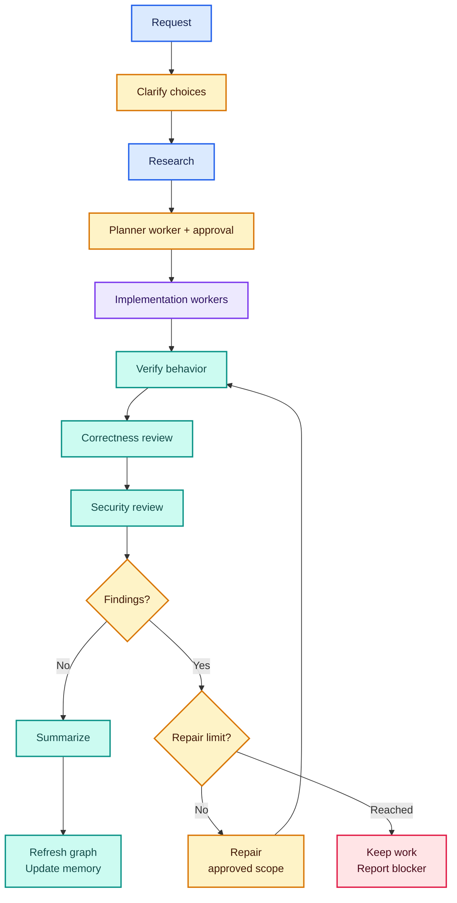
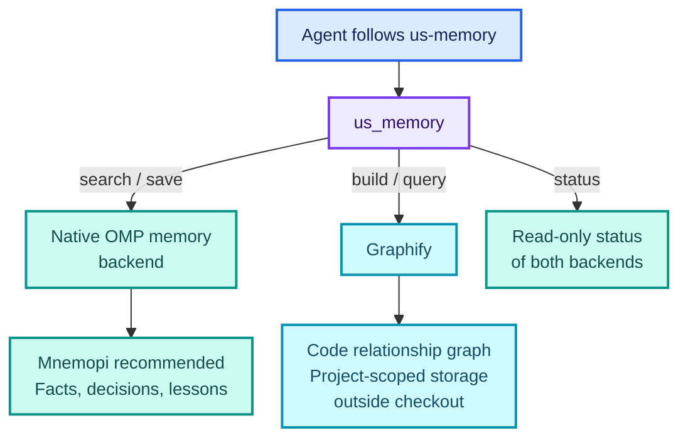

# Useful Skills for Oh My Pi

**From a natural-language request to reviewed, verified work.**

Owned `us-*` skills for development, focused audits, delivery, and project memory. OMP discovers their descriptions; the model follows the relevant instructions using native tools and workers.

| Develop | Inspect | Deliver | Remember |
| --- | --- | --- | --- |
| Clarify, research, approve, implement, review | Focused security, performance, and quality audits | Explicitly authorized PR or direct-main delivery | Durable facts alongside code relationships |

**Start here:** [Installation](#installation) · [Workflow & skills](#skill-led-development) · [Model configuration](#native-model-configuration) · [Memory](#agent-invoked-memory)

**Reference:** [Management](#management-and-optional-library) · [Audits & delivery](#focused-audits-and-delivery) · [Updates](#updates-and-releases) · [Development](#development-and-verification) · [Attribution](#attribution)

No Anvil dependency, custom workflow executor, model router, phase database, or stop-hook continuation loop.

## Installation

Requires OMP with marketplace support and Node.js **22+**. No npm dependencies, build step, host configuration, prompt file, or startup flag is required.

```bash
omp plugin marketplace add MSpiechowicz/oh-my-pi-useful-skills
omp plugin install oh-my-pi-useful-skills@omp-useful-skills --scope user
```

Restart OMP after installation or update. Ordinary startup with the installed package adds the discovery hint and narrowly scoped session-local workflow-stage policy. Use `--scope project` for a project installation, or pass `--profile NAME` to both commands for an isolated profile. Plugin identity remains `oh-my-pi-useful-skills@omp-useful-skills`.

For local development, load the **package directory**, not the extension file alone:

```bash
omp -e /absolute/path/to/oh-my-pi-useful-skills
```

`./useful-skills install [--scope user|project] [--profile NAME]` installs the published marketplace plugin, not the checkout itself. Source checkouts are updated with `git pull --ff-only`; the updater never overwrites them.

## Skill-led development

Ask naturally: “I want to build a rocket simulator.” With the current session's workflow enabled (the default), `us-workflow` guides the following development flow. Precise requests can require zero clarification questions. Small changes scale the depth without omitting research, reviews, or memory; small size alone does not opt out.



Verification failures return to implementation. Repairs repeat verification and **both** reviews. Three unsuccessful repair rounds or repeated no progress stop the loop; memory failures prevent claiming the full workflow complete. Publication is a separate, explicitly authorized action—not the next automatic step.

The parent owns the objective, research scope, native todo list, acceptance, approval, and integration. Research uses a read-only worker; after the parent completes research, the native `planner` worker drafts a bounded plan. The plan classifies each implementation package as frontend, backend, or genuinely neither. After approval, frontend packages use `frontend`, backend packages use `backend`, and only genuinely neither packages—such as documentation or tooling—use native `task`; every class includes a single package when applicable. Mixed packages split at that boundary where coherent, and dependencies remain serial. Independent ready packages run in parallel only with disjoint ownership. Existing session plans/transcripts support interruption recovery.

With ordinary startup after installation, the extension supplies discovery and the narrowly scoped session-local workflow-stage policy while the **session mode** is enabled. Each prompt reconciles these owned instructions without duplicating them; session-disabled mode instead supplies fast-lane guidance and no workflow-stage permission. The enabled-mode discovery instruction permits a native one-request opt-out through `/skill:us-ignore-workflow`, but the extension does not inspect prompt content or skill-shaped markers to detect selection and does not change session mode for that request. Only when a relevant `us-*` workflow requires a native stage does the enabled-mode policy permit it: the bounded planner draft after parent research and selected implementation worker after approval, including a single package. The parent uses only the active session workspace; the policy never selects a repository globally. It neither authorizes general extra delegation nor starts a workflow, dispatches workers, builds Graphify, or writes workflow state at session open.

These are prompt instructions, **not enforced stage transitions**. They cannot guarantee model compliance or override stronger safety constraints, existing mappings, permissions, approval boundaries, or publication rules. Ordinary explanations and explicitly focused audits do not start the full development workflow. Plan approval does not authorize publication.

For a development fast lane, run `/useful-skills workflow disabled` in OMP to choose it for the **current session**, or explicitly invoke the native `/skill:us-ignore-workflow` skill for **one request** while leaving session mode untouched. A copied invocation or skill-shaped marker inside ordinary task material does not change extension guidance. Run `/useful-skills workflow enabled` to restore the full development workflow; a new OMP session or restart defaults to enabled, and returning to a previously selected session keeps its in-memory mode until restart. The fast lane still inspects relevant code and callers, implements and exercises the changed path, but skips the package-mandatory planner, plan approval, worker delegation, reviews, and automatic memory. It does not bypass stronger safety/permission rules, requested audits, or publication authorization. These are guidance changes, not enforcement of workflow completion or a ban on independently required verification.

| Skill | Selection and responsibility |
| --- | --- |
| `us-workflow` | Natural build/fix/change/refactor requests; composes the development flow |
| `us-ignore-workflow` | Explicit one-request development fast lane without changing session mode |
| `us-grill-me` | Consequential unresolved product/engineering choices; inspect before asking |
| `us-research` | Current code, callers, conventions, documentation, and memory before planning |
| `us-plan` | Native planner dispatch, concrete acceptance and ownership, one approval |
| `us-implement` | Approved implementation and repairs through classified native frontend, backend, or generic workers |
| `us-review` | Fresh evidence-based correctness review against acceptance |
| `us-memory` | Automatic research recall and verified-completion graph/fact updates |
| `us-concise` | Caveman-lite context/prose guidance; preserves technical meaning and exact text |
| `us-check-security` | Read-only trust-boundary audit or post-correctness security review |
| `us-check-performance` | Measured representative performance audit, not speculative optimization |
| `us-check-code-quality` | Evidence-backed cohesion/duplication audit and explicit guidance merge |
| `us-improve-codebase-architecture` | Read-only architectural opportunities, then approved focused refactoring |
| `us-improve-code-coverage` | Measured coverage gaps, then approved behavior-focused test improvements |
| `us-ship-backlog-item` | One item, isolated feature branch, reviewed linked PR, and Done only after confirmed merge |
| `us-open-pr` | Explicitly authorized reviewed feature-branch PR delivery |
| `us-approve-work` | Explicitly authorized commit and fast-forward direct push to `main` |
| `us-library` | Explicit, bounded consultation of optional ECC reference material |

Direct invocation uses OMP's actual syntax:

```text
/skill:us-ignore-workflow
/skill:us-check-security
/skill:us-check-performance
/skill:us-check-code-quality
/skill:us-improve-codebase-architecture
/skill:us-improve-code-coverage
/skill:us-ship-backlog-item
/skill:us-open-pr
/skill:us-approve-work
```

No extension-command wrapper is installed for each skill. Add a matching `skills/us-example/SKILL.md` with a concrete single-line frontmatter `description`; native shallow discovery and the catalog need no JavaScript registry update. Keep substantial checklists/worker briefs in skill-local references linked through `skill://us-<name>`.

### Jev assessment — no integration

Assessed 2026-09-23: [TypeSafe's coding-agent guidance](https://docs.typesafe.ai/introduction/coding-agents) positions Jev for narrow typed decisions inside an application, not as a drop-in coding agent. It could advise on bounded classifications, but is not a workflow executor or an authority for agent dispatch or approval.

The [official API](https://docs.typesafe.ai/api) documents `POST https://api.typesafe.ai/v1/systemone` with state and typed questions; [Jev 1.13 model limits](https://docs.typesafe.ai/models) are 64k tokens total per request and 32k tokens for the state plus longest question. The [community Jev API page](https://www.jevai.org/docs) separately claims a `https://www.jevai.org/api/v1/decisions/route` endpoint and a 32 KiB HTTP body cap; neither is corroborated by the official TypeSafe docs.

Sending task context would disclose prompt data to the service. TypeSafe's [privacy policy](https://typesafe.ai/legal/privacy-policy) says inputs are not used to train or fine-tune models but gives no fixed API-log retention period. Its [Master Customer Agreement](https://typesafe.ai/legal/mca) permits Customer Data processing during the term and in perpetuity for telemetry, fraud prevention, and legal purposes; telemetry may be processed without restriction, including to improve services and products. API calls consume credits under that agreement.

No Jev integration is included and no task context is sent. Any future integration requires separate explicit approval and opt-in context transmission; its output must remain advisory and cannot replace parent judgment or human approval.

## Native model configuration

Useful Skills bundles native `planner`, `frontend`, and `backend` agents; it does not add a model router or workflow executor. Ordinary installed startup needs no role mapping, global host override, prompt file, or extra flag for the session-local workflow-stage policy. Existing OMP mappings remain authoritative. If you want to choose distinct mappings, use OMP's native roles in the active profile, project configuration, overlays, or runtime options; Useful Skills never changes them.

Open `/model`, then the **Roles** view, to optionally assign and persist role mappings. This example uses only OpenAI Codex selectors; availability depends on your OMP model catalog and credentials, not on this table.

| Role | Native task agent | Example model |
| --- | --- | --- |
| `research` | `scout` | `openai-codex/gpt-5.6-luna:xhigh` |
| `frontend` | `frontend` | `openai-codex/gpt-5.6-terra:high` |
| `backend` | `backend` | `openai-codex/gpt-5.6-terra:high` |
| `implementation` | `task` | `openai-codex/gpt-5.6-terra:high` |
| `review` | `reviewer` | `openai-codex/gpt-6-astra:medium` |
| `security` | `security-reviewer` | `openai-codex/gpt-5.6-sol:high` |
| `plan` | `planner` | `openai-codex/gpt-6-astra:high` |

`task` is reserved for work genuinely neither frontend nor backend.

`planner` is bundled and read-only.

```yaml
modelRoles:
  research: openai-codex/gpt-5.6-luna:xhigh
  frontend: openai-codex/gpt-5.6-terra:high
  backend: openai-codex/gpt-5.6-terra:high
  implementation: openai-codex/gpt-5.6-terra:high
  review: openai-codex/gpt-6-astra:medium
  security: openai-codex/gpt-5.6-sol:high
  plan: openai-codex/gpt-6-astra:high

task:
  agentModelOverrides:
    scout: "@research"
    frontend: "@frontend"
    backend: "@backend"
    task: "@implementation"
    reviewer: "@review"
    security-reviewer: "@security"
    planner: "@plan"
```

Native dispatch selects an **agent type**, not a model. For every dispatched agent, `task.agentModelOverrides[agentName]` always wins; otherwise OMP uses the agent's `model` frontmatter and then its native fallback. Role aliases such as `@review` resolve through `modelRoles`. `frontend` and `backend` prioritize `@frontend` and `@backend` respectively, then `@implementation`; `planner` declares `model: "@plan"`. These optional mappings and frontmatter do not prove the running worker's model. Do not edit user configuration automatically.

Loading a skill or defining a role does not execute that role's model. The installed extension's session-local policy permits the relevant stage only: `us-plan` dispatches a bounded `planner` draft after parent research, and `us-implement` dispatches `frontend`, `backend`, or `task` after approval according to the package classification, including a single package. The parent integrates the plan and requests approval before implementation. Report configured routing separately from actual worker/model metadata when it is available.

After ordinary installation and restart, the package advertises its native agents and defaults to enabled workflow guidance without extra configuration. If an agent is absent, no allowed configured/frontmatter/native route resolves, runtime metadata is unavailable, or stronger host policy prohibits delegation, report the specific limitation rather than silently doing the work in the parent or claiming the requested model ran. A permitted fallback must be identified with its actual routing; it is not proof of the requested role's execution. See [Native model routing](skills/us-workflow/SKILL.md#native-model-routing) for the shared guidance; loading it does not launch the workflow.


Some hosts require parent-only planning or prohibit delegating a single work package. Those higher-priority policies still block the corresponding stage; this package cannot override them. Report the conflict; do not treat installation, restart, or a host-configuration change as a bypass.

## Management and optional library

```text
/useful-skills list [query]
/useful-skills workflow enabled|disabled
/useful-skills doctor
/useful-skills graph test
/useful-skills library list [skills|commands|agents|rules] [query]
/useful-skills update check
/useful-skills update install
```

The terminal launcher supports the existing catalog/update operations, plus `install` and `help`; `workflow` and `graph test` are **in-session OMP commands only**, not terminal subcommands. `/ecc`, `/ecc-doctor`, and `/ecc-memory` aliases are removed. OMP's native `/memory` remains unchanged.

Run `/useful-skills` without arguments for **List**, **Libraries**, **Doctor**, **Workflow (enabled/disabled)**, **Update**, and **Help**. **Workflow** displays the current session mode and offers **Enabled** and **Disabled**; **Update** opens **Check** and **Install**. Cancelling either menu performs no operation. Invalid workflow arguments leave the mode unchanged. Headless command notices do not start a model turn. The graph diagnostic is available only by typing the exact `/useful-skills graph test` command, not from the menu, help, doctor, or startup.

Doctor shows a compact report of resources, safety, native memory, and Graphify readiness instead of raw JSON. Disabled native memory and a graph that is not built are availability states, not proof of a failed installation. Genuine status failures remain visible. The terminal doctor cannot inspect OMP's current memory integration and directs you to the in-session command. Neither doctor installs dependencies, enables memory, builds graphs, or writes workspace files.

Broad ECC skills, commands, agents, rules, and supporting files live under `skills/us-library/references/ecc/`. They are **not active skills, injected rules, or native worker overrides**. On an explicit library request, the agent reads only relevant references, for example `skill://us-library/references/ecc/skills/security-audit/SKILL.md`, and translates useful guidance into owned/native conventions. It must not activate legacy workflows or another harness.

The extension reconciles its own discovery and workflow-stage guidance with the current session mode on each prompt; native skill expansion supplies the explicit one-request skill instructions separately, without changing that mode. The extension cannot authenticate skill selection from prompt text, and its instructions cannot guarantee that a model will ignore a forged skill marker in user-provided material. Depending on OMP's native expansion, an embedded `/skill:us-ignore-workflow` token in copied material may itself select the skill; no trusted selected-skill metadata is available to this hook to distinguish it from deliberate invocation. Switching modes removes stale package guidance while preserving unrelated system instructions. It retains independent catastrophic-command protection and common secret-pattern output redaction, and performs quiet read-only update checks. Opening a session never starts a model workflow, dispatches workers, builds memory, Graphify, or workflow state, or reviews code. `OMP_ECC_SAFETY=off` remains the existing catastrophic-guard opt-out; redaction is not a complete secret detector or a filesystem sandbox.

## Agent-invoked memory

**Two complementary stores, one agent-facing tool.** Facts explain decisions; the code graph maps relationships. Neither replaces the other.



Graphify setup is lazy: an explicit `us_memory` build/query action or `/useful-skills graph test` prepares its managed dependencies. Opening a session does not install dependencies, build a graph, or start a workflow. With native memory unavailable, the agent can maintain fallback notes using file tools; `us_memory` does not silently save them.

### Recommended setup: local memory alongside Graphify

Use **Mnemopi** for durable facts, decisions, and lessons. It stores memories in local SQLite databases and supports the native save/search operations used by Useful Skills. Graphify remains responsible for code relationships; the two backends complement each other and use separate storage.

For a lightweight, project-isolated setup, copy these commands into your terminal:

```bash
omp config set memory.backend mnemopi
omp config set mnemopi.scoping per-project
omp config set mnemopi.autoRetain false
omp config set mnemopi.noEmbeddings true
omp config set mnemopi.llmMode none
```

This enables explicit memory saves and full-text search without automatically retaining conversation turns, loading embedding models, or making memory-related LLM calls. Full-text search matches words rather than providing embedding-based semantic similarity. These settings configure OMP's native backend; Useful Skills does not change them automatically.

If you use a named profile, apply every command to that profile—for example, `omp --profile work config set memory.backend mnemopi`. Restart OMP after configuring it. Then run this **inside OMP**, not in your shell:

```text
/memory diagnose
```

Ask the assistant to check memory status and verify a small save/search round trip. The native backend should report `mnemopi`, not `off`; a save is successful only when storage is confirmed.

| `us_memory` action | Backend and purpose |
| --- | --- |
| `build` / `query` | Graphify: refresh or query the code graph |
| `save` / `search` | Mnemopi: store or retrieve durable facts |
| `status` | Check both native memory and Graphify |

Enabling Mnemopi does not replace or rebuild Graphify. Searching saved facts does not search the code graph, and rebuilding the graph does not update saved facts. Existing fallback `notes.md` files are not imported automatically. With native memory set to `off`, Graphify still works, but native saves/searches are unavailable.

### Tool contract and managed graph storage

The model follows `us-memory` automatically; the user need not run Graphify or a memory command during an ordinary task. For a deliberate graph diagnostic without starting an agent task, type `/useful-skills graph test` inside OMP. It first announces possible lazy managed setup and profile-local graph writes, builds the current session workspace, then queries the fixed symbol `main` only after a successful build. For example, a repository with `app.py` defining `main` and `helper` can return those nodes and their relationships; other repositories may have no matching `main` symbol. The command reports the actual generation, node/edge/source counts, graph storage path, query text, and returned output. Graphify's `No matching nodes found.` response is explicitly reported as no matches; an empty response does not claim retrieved relationships. Build/query errors and a changed active generation are reported by stage. Notifications redact common secret patterns and limit display size, but redaction is not complete secret detection. This command does not invoke native memory save/search, start a workflow, or prompt for `us_memory` tool exec approval: typing it is the explicit request for setup and graph writes. Doctor and other passive commands remain read-only.

The essential `us_memory` tool exposes only:

```text
{ action: "status" }
{ action: "build" }
{ action: "query", query: "..." }
{ action: "search", query: "..." }
{ action: "save", content: "..." }
```

Unused `query` and `content` fields may be omitted or set to `null` when a provider requires every schema property. For example, `{ action: "status", query: null, content: null }` is valid. Active payloads must still be non-empty text; unknown fields and non-null payloads belonging to another action are rejected.

`status` is read-only. `search/save` adapt the current native OMP backend, reporting unavailable/failed/queued outcomes honestly. Secret-shaped facts are rejected **before** native storage, not merely redacted afterward. Only actual storage is reported as saved. This detector is a backstop, not a guarantee.

Graphify `build/query` lazily prepare pinned managed dependencies on their first explicit agent call; the typed graph diagnostic uses the same build/query implementation. There are no startup installs, persistent watcher, MCP server, semantic LLM extraction, embeddings, paid service, or remote memory backend added by this package. Strict plan/read-only mode defers setup/build/cache writes during agent tasks and continues source research; the direct diagnostic is a separately typed, explicit command, not an agent mode detector.

Managed Graphify targets **Linux x64 (glibc)** and **macOS Darwin ARM64**. Other OS/architecture pairs return an explicit setup limitation; there is no global-install fallback. Pins: uv **0.12.17**, CPython **3.12.14 / 20260901**, Graphify **0.9.65**. `dependencies/manifest.json`, `graphify.in`, and the resolved wheel/hash lock define installation; no floating resolution runs on the user's machine. Downloads are verified; setup has a ten-minute deadline and uses only profile-owned locations. Healthy installations are reused offline. Adding Darwin metadata does not invalidate existing healthy Linux installations. Updated pins apply on the next Graphify action. Darwin behavior has Linux-host simulated coverage, but no native macOS ARM64 execution was available for verification.

The managed uv archive must match its pinned SHA-256 checksum, and `uv --version` must identify the pinned version and exact platform target. Upstream release commit/date metadata is accepted; a different version or target is not.

Managed setup uses OS-provided tools with no manual setup beyond updating Useful Skills: Linux uses `tar`, `flock`, and `timeout`; macOS uses system `tar` and `/usr/bin/lockf` in inherited-descriptor mode. The bundled Node watchdog bounds Darwin installer subprocesses independently if their coordinator disappears. Setup uses an OS-owned advisory lock shared with active installer processes, so retries cannot overwrite a surviving installer's files after coordinator exit. No Homebrew, separate Python, uv, or other host configuration is required.

Memory lives outside the checkout:

```text
<agentDir>/useful-skills/dependencies/<lockHash>/
<agentDir>/useful-skills/memory/<sha256(realpath(workspace))>/
```

The tool returns actual graph, snapshot, and fallback `notes.md` paths. Fresh code-only extraction replaces a graph only after successful validation, preserving the previous graph on failure. Builds are limited to 120 seconds; queries to 10 seconds, 4,096 input characters, and 8 KiB returned text. Generated/credential paths and outside-root symlinks are excluded; unsupported inputs are not claimed as covered. Isolated Python imports, a trusted cwd, and a minimal environment reduce project interference; they are **not** a same-user filesystem/network sandbox.

Extraction uses Graphify's finalized graph, including local community analysis, rather than its raw `--no-cluster` output; code-only mode still makes no semantic LLM calls. External import concepts, unresolved AST references, and import-only package or HTTPS references remain in the graph without being counted as local source files. Package and HTTPS references must be AST leaf nodes linked by imports from local files; missing local files, generated/credential paths, and outside-root symlinks still fail validation. An empty directory currently produces an upstream extraction error rather than a published empty snapshot.

Narrative facts complement Graphify's code relationships. With no native backend, the agent uses native file tools to preserve concise secret-free notes at the returned path. Never store credentials, personal data, transcripts, or tool dumps. Fallback-note safety is instruction-guided, not tool-enforced. Important recalled facts must be rechecked against current source. Memory failure does not undo verified implementation, but prevents claiming the entire workflow completed.

## Focused audits and delivery

Security/performance audits default to read-only local investigation. No production probing, automatic fixes, or implicit profiler installation. Explicit code-quality invocation merges [the quality template](skills/us-check-code-quality/CODE_QUALITY.md) into `.agents/CODE_QUALITY.md`, preserving project-specific guidance; it does not authorize application edits.

`us-improve-codebase-architecture` investigates architectural friction and presents evidence-backed candidates with before/after diagrams, tradeoffs, and a recommendation. It respects existing domain language and architectural decisions. Selecting a candidate leads into the existing research, clarification, and plan-approval process; discovery alone does not authorize refactoring or documentation edits.

`us-improve-code-coverage` measures existing coverage and prioritizes uncovered public behavior, branches, and failure paths. Test changes require plan approval and before/after results use the same measurement scope. Missing coverage tooling is reported, not silently installed; empty projects do not acquire invented tests. The skill does not lower thresholds, hide uncovered code, or silently fix production bugs.

Both skills reuse the owned implementation, correctness/security review, and memory guidance after approval. They add no runtime dependency or separate workflow executor.

`us-ship-backlog-item` distinguishes read-only selection from explicit shipment. A request to ship an item (or an explicit skill invocation without narrower limits) authorizes the reviewed feature-branch/PR delivery and that item's status updates, but still requires implementation-plan approval. It creates a safely isolated branch before edits, tracks **In progress → In review**, and hands reviewed delivery to `us-open-pr` without asking for the same PR authorization twice. Requests only to inspect/select or implement an item do not implicitly authorize publication.

The linked PR uses `Closes #N` when it fully resolves the issue and targets the default branch; other cases retain a non-closing reference and an explicit completion limitation. **Done requires confirmed merge of the correct PR**, not PR creation, green CI, or closure without merge. Existing project automation may complete tracking; otherwise a later invocation verifies the merge and updates the selected issue/item. Skills do not run after a session ends, configure automation, merge PRs, or silently overwrite conflicting human status changes. Missing project access or status mappings are reported, not treated as success. Local-only backlog entries receive no fabricated GitHub issue.

`us-open-pr` inspects all outgoing history/diffs, preserves unrelated staged/worktree changes, pushes the reviewed feature head, creates or reuses the exact head/base PR, and verifies URL and head SHA. It never silently rebases, force-pushes, changes destination, or merges.

`us-approve-work` requires an explicit delivery request. It commits only approved work and uses non-force `HEAD:refs/heads/main` only when the fetched remote main is an ancestor. Ambiguous, divergent, protected, or unrelated outgoing work blocks delivery. No silent PR substitution or branch-protection bypass. Remote tip verification is required before reporting success.

## Updates and releases

`update check` is quiet/read-only at interactive startup; explicit failures are reported. `update install` immediately announces that Useful Skills is updating through OMP's native plugin manager, then reports the result. It retains native active-install ownership, scope/profile, and stable-version checks. Only the active unambiguous marketplace installation is upgraded. After a published release, installed copies receive the new agents only after **Update → Install** and restart.

The existing single-plugin release transaction is unchanged: CI checks precede the atomic package/marketplace version commit and branch/tag push by `release.py`. No publication is performed merely by implementing a plan. Python 3.10+ is needed for release-development checks, not normal plugin installation.

## Development and verification

```bash
node --test
node --test --experimental-test-coverage --test-coverage-exclude='test/**' --test-coverage-lines=80 --test-coverage-functions=80 --test-coverage-branches=80
python -m unittest discover -s test -p 'test_*.py'
node --check extension.js
./useful-skills list
./useful-skills doctor
```

Use Node 22 in CI and at least 80% line/function/branch coverage for changed helpers. Keep authored source/test files at or below [500 physical lines](.agents/CODE_QUALITY.md).

Deterministic helper tests are not evidence that a model follows skills. Live evaluation needs a disposable fresh repository, clean profile, a normally configured model, native transcripts, and the normally installed extension. Start OMP normally after installation—without `-e`, a prompt file, or a host-policy override—and record the package, skills, rules, tools, advertised agents, and any actual worker/model metadata before prompting.

Repeat the same normal development prompt three times. Exercise parent research, the bounded planner draft and approval, frontend, backend, and genuinely neither package classification, the corresponding selected worker—including a single package—independent/shared-file work, both reviews, repair/recovery, memory and fallback-note privacy, concise prose, explanations, focused audits, and isolated delivery. Record actual dispatched-worker and model metadata when available; configuration alone is not proof of runtime routing. Then disable the extension in a separate fresh-repository/profile run and repeat the stage prompt to confirm the extension-provided policy is absent. Never copy credential files. Missing model credentials or unavailable worker metadata is a limitation, not a pass. Fake-`gh` checks are contract simulations; live GitHub delivery requires a separately authorized disposable repository.

These are live-verification instructions, not recorded runtime acceptance. They do not claim that the check passed or that issue #5's frontend or backend was implemented.

## Attribution

[upstreams.lock.json](upstreams.lock.json) records exact source pins and upstream license URLs. Attribution and license text are separated by repository:

| Upstream repository | Resources used here | License files |
| --- | --- | --- |
| [Everything Claude Code](https://github.com/affaan-m/ECC) | Archived optional resources in `skills/us-library/references/ecc/` and reviewed prompt practices | [MIT license and attribution](licenses/ecc/LICENSE.txt) |
| [Superpowers](https://github.com/obra/superpowers) | Reviewed prompt practices informing adapted workflow guidance; not a runtime dependency | [MIT license and attribution](licenses/superpowers/LICENSE.txt) |
| [Matt Pocock skills](https://github.com/mattpocock/skills) | Reviewed prompt practices informing adapted skill guidance; not a runtime dependency | [MIT license and attribution](licenses/mattpocock-skills/LICENSE.txt) |
| [Caveman](https://github.com/juliusbrussee/caveman) | Concise-prose guidance in `skills/us-concise/`; no engine-linked runtime | [MIT license, attribution, and scope](licenses/caveman/LICENSE.txt) |
| [Graphify](https://github.com/Graphify-Labs/graphify) | Separately managed `graphifyy` dependency for explicit graph builds and queries | [Apache-2.0 license](licenses/graphify/LICENSE.txt), [retained MIT license](licenses/graphify/LICENSE-MIT.txt), and [NOTICE](licenses/graphify/NOTICE.txt) |

Upstream prompt sources are not workflow dependencies or runtime auto-sync targets. Caveman's engine-linked directories have separate BSL-1.1 terms and are not included here. Graphify's upstream NOTICE refers to `LICENSE` and `LICENSE-MIT`; their copies here use the `.txt` filenames linked above. No Anvil code, configuration, histories, or installed extension is changed. This repository remains [GPL-3.0-only](LICENSE); third-party portions retain their stated licenses.
