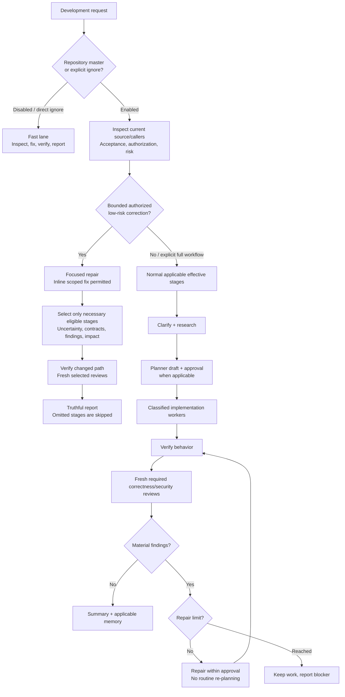
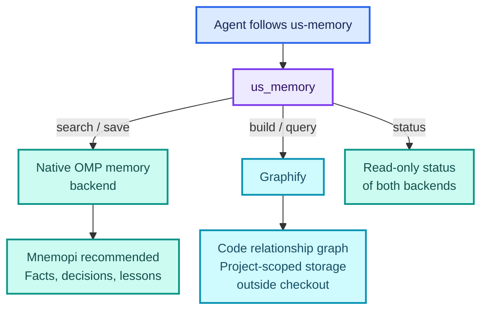

# Useful Skills for Oh My Pi

**From a natural-language request to reviewed, verified work.**

Owned `us-*` skills for development, focused audits, delivery, and project memory. OMP discovers their descriptions; the model follows the relevant instructions using native tools and workers.

| Develop | Inspect | Deliver | Remember |
| --- | --- | --- | --- |
| Clarify, research, approve, implement, review | Focused security, performance, and quality audits | Explicitly authorized feature-branch PR delivery | Durable facts alongside code relationships |

**Start here:** [Installation](#installation) · [Claude Code](#claude-code) · [Workflow & skills](#skill-led-development) · [Model configuration](#native-model-configuration) · [Memory](#agent-invoked-memory)

**Reference:** [Management](#management-and-optional-library) · [Audits & delivery](#focused-audits-and-delivery) · [Updates](#updates-and-releases) · [Development](#development-and-verification) · [Attribution](#attribution)

No Anvil dependency, custom workflow executor, model router, phase database, or stop-hook continuation loop.

## Installation

Requires OMP with marketplace support and Node.js **22+**. No npm dependencies, build step, host configuration, prompt file, or startup flag is required.

```bash
omp plugin marketplace add MSpiechowicz/harness-useful-skills
omp plugin install harness-useful-skills@harness-useful-skills --scope user
```

These commands and `./useful-skills install` below require a published release of the new catalog; until then, load this source checkout with `omp -e /absolute/path/to/harness-useful-skills` as shown below.

Restart OMP after installation or update. Ordinary startup adds discovery and, when enabled for the current repository in the active profile, narrowly scoped session-local workflow-stage guidance. Use `--scope project` from the project directory for a project installation, or prefix both commands with `omp --profile NAME` for an isolated profile. Installation scope is separate from the repository-local workflow master and six profile-wide stage preferences. The marketplace and plugin are both named `harness-useful-skills`; the OMP plugin ID is `harness-useful-skills@harness-useful-skills`. OMP does not import this plugin's Claude Code MCP server: its manifest declares empty `mcpServers`. Claude Code loads its own separate MCP tools when installed there.

### Remove or migrate an OMP installation

Uninstall each historic ID that is installed in the relevant scope; check `omp plugin list --json` if unsure. These commands remove installed plugins, not their marketplace registration:

```bash
omp plugin uninstall oh-my-pi-useful-skills@omp-useful-skills --scope user
omp plugin uninstall useful-skills@omp-useful-skills --scope user
```

An old installation is not renamed by updating a checkout or publishing a release, and loading the checkout does not remove its startup message. You can uninstall it before the new catalog is published. If no plugins need the old marketplace, optionally remove its registration with `omp plugin marketplace remove omp-useful-skills`. After the new catalog is published, use the installation commands above to add the new marketplace and install the new ID. The updater does not migrate old installations or marketplace registrations.

For a project installation, run these commands from that project directory with `--scope project` instead of `--scope user`. For an isolated profile, prefix **each** command with `omp --profile NAME` instead of `omp`, retaining the original scope and project directory. Restart OMP after installation.

For local development, load the **package directory**, not the extension file alone:

```bash
omp -e /absolute/path/to/harness-useful-skills
```

`./useful-skills install [--scope user|project] [--profile NAME]` installs the published marketplace plugin, not the checkout itself. Source checkouts are updated with `git pull --ff-only`; the updater never overwrites them.

### Claude Code

The Claude Code adapter requires Node.js **22+** and a marketplace installation. For a local checkout, use its absolute path:

```bash
claude plugin marketplace add /absolute/path/to/harness-useful-skills --scope user
claude plugin install useful-skills@useful-skills-local --scope user
```

Or add the same repository as a GitHub marketplace:

```bash
claude plugin marketplace add MSpiechowicz/harness-useful-skills
claude plugin install useful-skills@useful-skills-local --scope user
```

The Claude plugin ID remains `useful-skills@useful-skills-local` in either case. Install through the marketplace, **not** `claude --plugin-dir .`: that loads the repository-root OMP `skills/` instead of the marketplace's selected Claude skills. Restart Claude Code after installation. The OMP installation, commands, and profile behavior above remain unchanged.

Claude exposes 18 namespaced skills (for example, `/useful-skills:us-workflow`) and seven native agents: `planner`, `scout`, `frontend`, `backend`, `general-purpose`, `reviewer`, and `security-reviewer`. All declare `model: inherit`; per-role models come from a Claude-owned config file instead (see [Claude Code model roles](#claude-code-model-roles)). Permissions and stronger host rules remain authoritative. Plugin `userConfig` has seven default-`true` booleans: `workflow`, `research`, `plan`, `review`, `security_review`, `backend_memory`, and `graphify_memory`. Configure them in Claude Code's `/plugin` configure flow or at install time with repeatable `--config key=false` flags (for example, `--config workflow=false`). Disabling `workflow` suppresses automatic stages without changing the other saved values. A **direct** `/useful-skills:us-ignore-workflow` invocation bypasses package-mandatory stages for one request only; quoted or copied text is not an opt-out. Claude has no OMP `/useful-skills` management command or OMP profile settings UI.

The Claude plugin adds a **separate** local stdio MCP server with five tools: `memory_status`, `memory_search`, `memory_save`, `graph_build`, and `graph_query`. Facts are project-scoped private files under Claude plugin data, searched by literal text; they are **not** OMP's native Mnemopi facts and are not shared with them. Graphify is the shared code-relationship implementation, with lazy managed setup on explicit graph actions rather than at startup. Do not save credentials, personal data, transcripts, or tool dumps; secret detection is only a backstop. A Bash pre-tool guard denies recognized dangerous commands, and successful tool responses can be redacted by `PostToolUse`; failed third-party tool responses (`PostToolUseFailure`) cannot receive equivalent redaction. These protections are not a sandbox or a substitute for Claude's permissions, user approval, or publication controls.

OMP's updater and release process do **not** update the Claude installation automatically. There is no Codex runtime adapter yet.

## Skill-led development

Ask naturally: “I want to build a rocket simulator.” Before composing stages, `us-workflow` inspects current source, relevant callers, acceptance, authorization, and risk, then briefly explains the selected lane. With the repository master enabled, the default full stages apply to normal work; a clear bounded low-risk correction within an authorized outcome can instead use focused repair. Size, urgency, a stale plan, or “already delivered” alone does not qualify.


```mermaid
flowchart TD
    request["Development request"] --> settings{"Repository master<br/>or explicit ignore?"}
    settings -->|Disabled / direct ignore| fast["Fast lane<br/>Inspect, fix, verify, report"]
    settings -->|Enabled| inspect["Inspect current source/callers<br/>Acceptance, authorization, risk"]
    inspect --> triage{"Bounded authorized<br/>low-risk correction?"}
    triage -->|Yes| focused["Focused repair<br/>Inline scoped fix permitted"]
    focused --> extra["Select only necessary eligible stages<br/>Uncertainty, contracts, findings, impact"]
    extra --> smoke["Verify changed path<br/>Fresh selected reviews"]
    smoke --> report["Truthful report<br/>Omitted stages are skipped"]
    triage -->|No / explicit full workflow| normal["Normal applicable effective stages"]
    normal --> research["Clarify + research"]
    research --> plan["Planner draft + approval<br/>when applicable"]
    plan --> implement["Classified implementation workers"]
    implement --> verify["Verify behavior"]
    verify --> reviews["Fresh required correctness/security reviews"]
    reviews --> outcome{"Material findings?"}
    outcome -->|No| finish["Summary + applicable memory"]
    outcome -->|Yes| limit{"Repair limit?"}
    limit -->|No| repair["Repair within approval<br/>No routine re-planning"]
    repair --> verify
    limit -->|Reached| blocked["Keep work, report blocker"]
```

Focused repair requires current source/caller inspection, an authorized scoped fix, observable changed-path verification, and a truthful report. A current bounded repair request or prior in-scope approval can authorize it without routine new planning/approval. The parent may fix inline; enabled switches alone do not require a new scout, planner, implementation worker, full reviews, or memory cycle. Select extra eligible stages for actual uncertainty, affected contracts, findings, or security/memory impact; follow each selected stage's own rules without automatically restarting the full flow. Disabled/unknown automatic stages are never silently activated, and explicit audits/full-workflow requests and independent controls remain binding.

Use normal composition for new or material behavior, architecture, broad/ambiguous failures, uncertain scope, security-sensitive changes, or an explicit full-workflow request. Investigate ambiguity before calling a failure small. In an already active normal workflow, repairs retain its required workers and fresh reviews; do not retroactively switch lanes to omit them. Prior approval covers in-scope repair without a new planner/approval cycle. Verification failures return to implementation; every required or selected review must be fresh after affected changes, and prior reviews do not cover newly changed code. Three unsuccessful repair rounds or repeated no progress stop the loop. Skipped stages are never called complete; an applicable required memory failure prevents claiming full completion. Publication is separate and explicitly authorized.

The parent owns objective, lane selection, research scope, native todo, acceptance, applicable approval, integration, and combined verification. In normal composition, enabled research uses a read-only worker and enabled planning uses native `planner` after parent inspection, followed by one approval. With no applicable plan stage, a bounded request can authorize implementation, subject to independent requirements. Required implementation packages—including one package—use `frontend`, `backend`, or native `task` for genuinely neither (documentation/tooling); eligible focused repair may be inline. Split coherent mixed boundaries, serialize dependencies/shared files, and parallelize only ready disjoint packages. Selected focused stages retain their own dispatch rules. Current source, not historical plans/transcripts alone, governs interrupted work.

Ordinary installed startup supplies discovery and a narrow session-local stage policy while the effective repository workflow is enabled. Each prompt reconciles owned instructions using the active workspace's master and profile stage preferences, preserving unrelated guidance. Enabled settings mean stage eligibility, not automatic execution; triage permits focused inline repair. A required applicable plan permits bounded `planner` dispatch after inspection; required classified implementation dispatch follows appropriate authorization, including a single package. No global repository is selected and no general extra delegation is authorized. Disabled master supplies fast-lane guidance. Native `/skill:us-ignore-workflow` selects a one-request exception separately: the extension does not classify prompt text or persist that choice. Startup never dispatches workers, builds Graphify, writes workflow state, or starts a model workflow.

These are prompt instructions, **not enforced stage transitions**. They cannot guarantee model compliance or override stronger safety constraints, existing mappings, permissions, independent approval boundaries, or publication rules. Ordinary explanations and explicitly focused audits do not start the full development workflow. Plan approval does not authorize publication.

For a persistent development fast lane, run `/useful-skills workflow disabled` **from the intended repository**; `/useful-skills workflow enabled` restores that repository's master in the active OMP profile. The choice survives sessions/restarts without affecting other repositories. The nearest canonical Git checkout root is the scope: root, subdirectories, and symlink aliases share; separate checkouts and linked worktrees isolate, as do nested checkouts. Outside Git, canonical cwd is the scope, so distinct non-Git directories are separate. Moving a checkout changes its path-derived identity; no relocation migration is performed.

The master is stored privately at `<agentDir>/useful-skills/workflow-settings/repositories/<sha256(scopeRoot)>/workflow.json`; six stage files remain in `<agentDir>/useful-skills/workflow-settings/`. Reads create nothing. Storage retains private directories/files, bounded no-follow reads, and atomic writes. Identity discovery inspects filesystem Git markers without executing project code/hooks or using Graphify. Unreadable/unsafe identity makes only the master unknown while independently readable profile stages remain visible; unknown automatic stages do not run. Status exposes canonical scope, master file, profile stage directory, saved/effective selections, and scoped errors.

**Legacy master:** the old profile-level `<agentDir>/useful-skills/workflow-settings/workflow.json` is untouched and ignored, with no fallback, copying, or automatic migration. A missing new repository master defaults enabled. To retain an old disabled choice, enter the intended repository and reapply `/useful-skills workflow disabled`.

Alternatively, directly invoke native `/skill:us-ignore-workflow` for one request without changing saved settings. Quoted/copied invocations are not selection. The disabled-master/direct-ignore fast lane still inspects current code/callers, implements and exercises the changed path, and reports evidence, but skips package-mandatory stages. It is distinct from enabled focused repair and does not waive stronger safety/permissions, independent authorization, explicit audits, or publication controls.

Six retained **profile-wide** switches control eligibility for individual automatic stages across repositories; all default enabled and changing one leaves the others intact. In normal composition, apply effective stages. Focused repair selects only necessary eligible extras rather than inheriting the whole cycle. Use `/useful-skills stage <name> enabled|disabled` with a name from this table:

| Stage name | When disabled |
| --- | --- |
| `research` | Skip the package-mandatory research stage; still inspect essential source code, callers, and behavior needed for the request. |
| `plan` | Skip the package-mandatory planner draft and plan approval; independently required authorization still applies. |
| `review` | Skip the automatic correctness review; security review remains independently controlled. |
| `security-review` | Skip the automatic security review; correctness review remains independently controlled. |
| `backend-memory` | Skip automatic native-memory fact search/save guidance, not explicit memory actions or host retention. |
| `graphify-memory` | Skip automatic Graphify graph build/query guidance, not explicit graph actions. |

Disabling a repository master suppresses all automatic stages there without changing the six profile-wide saved preferences or any other repository's master. Re-enabling restores their eligibility, not proof of execution; a disabled stage remains disabled. Direct one-request ignore takes precedence for that request only. Memory opt-outs are guidance, not provider/tool bans: explicit `us_memory`, graph test, doctor, and native `/memory` remain available and do not alter backend settings or host `autoRetain`. Configure host retention separately if unwanted. Prompt guidance cannot guarantee model compliance.

| Skill | Selection and responsibility |
| --- | --- |
| `us-workflow` | Natural development requests; pre-composition risk triage and applicable effective stages |
| `us-ignore-workflow` | Explicit one-request fast lane; changes no repository/profile settings |
| `us-grill-me` | Consequential unresolved product/engineering choices; inspect before asking |
| `us-research` | Current source/callers, conventions, documentation, and applicable memory when selected |
| `us-plan` | Applicable planner draft, concrete acceptance/ownership, one approval |
| `us-implement` | Authorized implementation/repairs, inline focused or required classified workers |
| `us-review` | Fresh required/selected evidence-based correctness review |
| `us-memory` | Explicit or applicable automatic recall and verified graph/fact updates |
| `us-concise` | Caveman-lite context/prose guidance; preserves technical meaning and exact text |
| `us-check-security` | Read-only trust-boundary audit or post-correctness security review |
| `us-check-performance` | Measured representative performance audit, not speculative optimization |
| `us-check-code-quality` | Evidence-backed cohesion/duplication audit and explicit guidance merge |
| `us-improve-codebase-architecture` | Read-only architectural opportunities, then approved focused refactoring |
| `us-improve-code-coverage` | Measured coverage gaps, then approved behavior-focused test improvements |
| `us-ship-backlog-item` | One item, isolated feature branch, reviewed linked PR, and Done only after confirmed merge |
| `us-open-pr` | Explicitly authorized reviewed feature-branch PR delivery |
| `us-approve-work` | Explicitly authorized approved-only commit and safe feature-branch PR against the verified GitHub default branch; commit-only stays local |
| `us-library` | Explicit, bounded consultation of optional ECC reference material |

Direct invocation uses OMP's actual syntax:

```text
/skill:us-ignore-workflow
/skill:us-check-security
/skill:us-check-performance
/skill:us-check-code-quality
/skill:us-improve-codebase-architecture
/skill:us-improve-code-coverage
/skill:us-ship-backlog-item
/skill:us-open-pr
/skill:us-approve-work
```

No extension-command wrapper is installed for each skill. Add a matching `skills/us-example/SKILL.md` with a concrete single-line frontmatter `description`; native shallow discovery and the catalog need no JavaScript registry update. Keep substantial checklists/worker briefs in skill-local references linked through `skill://us-<name>`.

### Jev assessment — no integration

Assessed 2026-09-23: [TypeSafe's coding-agent guidance](https://docs.typesafe.ai/introduction/coding-agents) positions Jev for narrow typed decisions inside an application, not as a drop-in coding agent. It could advise on bounded classifications, but is not a workflow executor or an authority for agent dispatch or approval.

The [official API](https://docs.typesafe.ai/api) documents `POST https://api.typesafe.ai/v1/systemone` with state and typed questions; [Jev 1.13 model limits](https://docs.typesafe.ai/models) are 64k tokens total per request and 32k tokens for the state plus longest question. The [community Jev API page](https://www.jevai.org/docs) separately claims a `https://www.jevai.org/api/v1/decisions/route` endpoint and a 32 KiB HTTP body cap; neither is corroborated by the official TypeSafe docs.

Sending task context would disclose prompt data to the service. TypeSafe's [privacy policy](https://typesafe.ai/legal/privacy-policy) says inputs are not used to train or fine-tune models but gives no fixed API-log retention period. Its [Master Customer Agreement](https://typesafe.ai/legal/mca) permits Customer Data processing during the term and in perpetuity for telemetry, fraud prevention, and legal purposes; telemetry may be processed without restriction, including to improve services and products. API calls consume credits under that agreement.

No Jev integration is included and no task context is sent. Any future integration requires separate explicit approval and opt-in context transmission; its output must remain advisory and cannot replace parent judgment or human approval.

## Native model configuration

Useful Skills bundles native `planner`, `frontend`, and `backend` agents; it does not add a model router or workflow executor. Ordinary startup needs no role mapping, global host override, prompt file, or extra flag for its narrow session-local policy. The repository master and profile stage preferences determine eligibility; pre-composition triage determines applicability. Existing OMP mappings remain authoritative. Optional distinct mappings use native roles in the active profile, project configuration, overlays, or runtime options; Useful Skills never changes them.

Open `/model`, then the **Roles** view, to optionally assign and persist role mappings. This example uses only OpenAI Codex selectors; availability depends on your OMP model catalog and credentials, not on this table.

| Role | Native task agent | Example model |
| --- | --- | --- |
| `research` | `scout` | `openai-codex/gpt-5.6-luna:xhigh` |
| `frontend` | `frontend` | `openai-codex/gpt-5.6-terra:high` |
| `backend` | `backend` | `openai-codex/gpt-5.6-terra:high` |
| `implementation` | `task` | `openai-codex/gpt-5.6-terra:high` |
| `review` | `reviewer` | `openai-codex/gpt-6-astra:medium` |
| `security` | `security-reviewer` | `openai-codex/gpt-5.6-sol:high` |
| `plan` | `planner` | `openai-codex/gpt-6-astra:high` |

`task` is reserved for work genuinely neither frontend nor backend.

`planner` is bundled and read-only.

```yaml
modelRoles:
  research: openai-codex/gpt-5.6-luna:xhigh
  frontend: openai-codex/gpt-5.6-terra:high
  backend: openai-codex/gpt-5.6-terra:high
  implementation: openai-codex/gpt-5.6-terra:high
  review: openai-codex/gpt-6-astra:medium
  security: openai-codex/gpt-5.6-sol:high
  plan: openai-codex/gpt-6-astra:high

task:
  agentModelOverrides:
    scout: "@research"
    frontend: "@frontend"
    backend: "@backend"
    task: "@implementation"
    reviewer: "@review"
    security-reviewer: "@security"
    planner: "@plan"
```

Native dispatch selects an **agent type**, not a model. For every dispatched agent, `task.agentModelOverrides[agentName]` always wins; otherwise OMP uses the agent's `model` frontmatter and then its native fallback. Role aliases such as `@review` resolve through `modelRoles`. `frontend` and `backend` prioritize `@frontend` and `@backend` respectively, then `@implementation`; `planner` declares `model: "@plan"`. These optional mappings and frontmatter do not prove the running worker's model. Do not edit user configuration automatically.

Loading a skill or defining a role does not execute that role's model. With workflow effectively enabled, pre-composition triage permits eligible focused inline repair without automatic planner, approval, or worker dispatch. Normal applicable enabled planning uses a bounded `planner` draft and one approval; normal implementation uses classified `frontend`, `backend`, or `task`, including one required package. Without an applicable plan stage, bounded authorization can suffice subject to independent requirements. Optional focused delegation retains classification and host permissions. Active normal-workflow repairs keep required workers and fresh reviews without routine new approval. Report configured routing separately from actual worker/model metadata.

After installation/restart the package advertises native agents and defaults to enabled repository masters and profile stage preferences unless saved otherwise. If a required agent is absent, routing cannot resolve, or stronger host policy prohibits dispatch, report the exact limitation rather than silently replacing it with parent work or claiming its model ran. Missing runtime metadata is not proof of a routing failure; report only observed metadata. Eligible focused inline repair remains allowed. A permitted fallback reports actual routing, not successful requested-role execution. See [Native model routing](skills/us-workflow/SKILL.md#native-model-routing); reading it does not launch the workflow.


### Claude Code model roles

Claude Code does not read OMP's `config.yml`. Its role models live in a Claude-owned file, `~/.claude/useful-skills/models.yml` (under `$CLAUDE_CONFIG_DIR` when set). The plugin's `SessionStart` hook creates it with these defaults the first time Claude Code starts after installation:

```yaml
modelRoles:
  research: claude-haiku-5-5:high
  frontend: claude-sonnet-5-5:high
  backend: claude-opus-5-5:high
  implementation: claude-sonnet-5-5:high
  review: claude-sonnet-5-5:medium
  security: claude-opus-5-5:high
  plan: claude-opus-5-5:high
  default: claude-opus-5-5:medium
```

A selector is `<model>[:<effort>]`: a Claude model ID or alias (`opus`, `sonnet`, `haiku`, `fable`, `inherit`) and an optional effort (`low`, `medium`, `high`, `xhigh`, `max`). An OMP-style `anthropic/` prefix is accepted, so the same values work in both hosts. A missing role uses `default`. `default` does not change the main session model; choose that with Claude's `/model`.

Claude Code cannot apply plugin options to plugin agent frontmatter, and the `Agent` tool accepts only model aliases without effort. So on each session start the hook generates user-level agents `us-planner`, `us-scout`, `us-frontend`, `us-backend`, `us-general-purpose`, `us-reviewer`, and `us-security-reviewer` in `~/.claude/agents/useful-skills-*.md`. Each one copies the bundled agent's instructions and tools and sets the configured `model` and `effort`. The hook tells the session to dispatch them in place of the `useful-skills:*` agents. Role mapping matches OMP: `scout` ← `research`, `planner` ← `plan`, `general-purpose` ← `implementation`, `reviewer` ← `review`, `security-reviewer` ← `security`.

Claude Code loads agents at startup, so edits to `models.yml` take effect in the **next** session; the first session after installation still uses the inherited-model plugin agents. An invalid file is reported and leaves existing generated agents unchanged. A file at one of those paths that Useful Skills did not generate is never overwritten; that role falls back to its plugin agent. Uninstalling the plugin does not remove the generated files; delete `~/.claude/agents/useful-skills-*.md` and `~/.claude/useful-skills/` yourself.

Some hosts require parent-only planning or prohibit delegating a single work package. Those higher-priority policies still block the corresponding stage; this package cannot override them. Report the conflict; do not treat installation, restart, or a host-configuration change as a bypass.

## Management and optional library

These management commands run in OMP, not Claude Code:

```text
/useful-skills list [query]
/useful-skills workflow enabled|disabled
/useful-skills stage <name> enabled|disabled
/useful-skills status
/useful-skills doctor
/useful-skills graph test
/useful-skills library list [skills|commands|agents|rules] [query]
/useful-skills update check
/useful-skills update install
```

The terminal launcher supports the existing catalog/update operations, plus `install` and `help`; `workflow`, `stage`, `status`, and `graph test` are **in-session OMP commands only**, not terminal subcommands. `/ecc`, `/ecc-doctor`, and `/ecc-memory` aliases are removed. OMP's native `/memory` remains unchanged.

Run `/useful-skills` without arguments for **List**, **Libraries**, **Doctor**, **Workflow**, **Workflow Stages**, **Status**, **Update**, and **Help**. **Workflow** shows the current repository's master and offers **Enabled**/**Disabled**; **Workflow Stages** controls six profile-wide preferences. Muted parenthesized status stays beside each label. Local Left returns to the parent; Escape closes without action; remote selection does not forward Left. `/useful-skills status` reports canonical repository scope, master path, stage directory, and saved/effective values. One-request ignore changes only guidance, not saved state. Read/write/identity errors are visible, never defaults or a claimed successful save; missing safe selections default enabled. Cancellation and invalid arguments leave settings unchanged; headless notices do not start model turns. Graph diagnostics require the exact typed command, not menu/help/doctor/startup.

Doctor shows a compact report of resources, safety, native memory, and Graphify readiness instead of raw JSON. Disabled native memory and a graph that is not built are availability states, not proof of a failed installation. Genuine status failures remain visible. The terminal doctor cannot inspect OMP's current memory integration and directs you to the in-session command. Neither doctor installs dependencies, enables memory, builds graphs, or writes workspace files.

Broad ECC skills, commands, agents, rules, and supporting files live under `skills/us-library/references/ecc/`. They are **not active skills, injected rules, or native worker overrides**. On an explicit library request, the agent reads only relevant references, for example `skill://us-library/references/ecc/skills/security-audit/SKILL.md`, and translates useful guidance into owned/native conventions. It must not activate legacy workflows or another harness.

On each prompt the extension reconciles owned guidance with the active workspace's repository master and profile stage settings; native one-request skill expansion remains separate. It does not classify tasks, authenticate selection from prompt text, or guarantee a model ignores forged markers. Depending on native expansion, an embedded token may select a skill; this hook has no trusted selected-skill metadata to distinguish copied material from deliberate invocation. Setting changes remove stale owned instructions while preserving unrelated guidance. Independent catastrophic-command protection, common secret-pattern output redaction, and quiet read-only update checks remain. Startup never starts a model workflow, dispatches workers, builds memory/Graphify, writes workflow state, or reviews code. `OMP_ECC_SAFETY=off` remains the existing guard opt-out; redaction is not complete secret detection or a filesystem sandbox.

## Agent-invoked memory

**OMP: two complementary stores, one agent-facing tool.** Facts explain decisions; the code graph maps relationships. Neither replaces the other.


```mermaid
flowchart TD
%%{init: {"flowchart":{"useMaxWidth":true,"nodeSpacing":24,"rankSpacing":30,"padding":10,"wrappingWidth":160},"themeVariables":{"fontSize":"14px"}}}%%
    agent["Agent follows us-memory"] --> tool["us_memory"]
    tool -->|search / save| native["Native OMP memory<br/>backend"]
    native --> facts["Mnemopi recommended<br/>Facts, decisions, lessons"]
    tool -->|build / query| graphify["Graphify"]
    graphify --> code["Code relationship graph<br/>Project-scoped storage<br/>outside checkout"]
    tool -->|status| status["Read-only status<br/>of both backends"]
    classDef blue fill:#dbeafe,stroke:#2563eb,color:#172554,stroke-width:2px;
    classDef violet fill:#ede9fe,stroke:#7c3aed,color:#2e1065,stroke-width:2px;
    classDef teal fill:#ccfbf1,stroke:#0d9488,color:#134e4a,stroke-width:2px;
    classDef cyan fill:#cffafe,stroke:#0891b2,color:#164e63,stroke-width:2px;
    class agent blue;
    class tool violet;
    class native,facts,status teal;
    class graphify,code cyan;
```

Graphify setup is lazy: an explicit `us_memory` build/query action or `/useful-skills graph test` prepares its managed dependencies. Opening a session does not install dependencies, build a graph, or start a workflow. With native memory unavailable, the agent can maintain fallback notes using file tools; `us_memory` does not silently save them.

### Recommended setup: local memory alongside Graphify

Use **Mnemopi** for durable facts, decisions, and lessons. It stores memories in local SQLite databases and supports the native save/search operations used by Useful Skills. Graphify remains responsible for code relationships; the two backends complement each other and use separate storage.

For a lightweight, project-isolated setup, copy these commands into your terminal:

```bash
omp config set memory.backend mnemopi
omp config set mnemopi.scoping per-project
omp config set mnemopi.autoRetain false
omp config set mnemopi.noEmbeddings true
omp config set mnemopi.llmMode none
```

This enables explicit memory saves and full-text search without automatically retaining conversation turns, loading embedding models, or making memory-related LLM calls. Full-text search matches words rather than providing embedding-based semantic similarity. These settings configure OMP's native backend; Useful Skills does not change them automatically.

If you use a named profile, apply every command to that profile—for example, `omp --profile work config set memory.backend mnemopi`. Restart OMP after configuring it. Then run this **inside OMP**, not in your shell:

```text
/memory diagnose
```

Ask the assistant to check memory status and verify a small save/search round trip. The native backend should report `mnemopi`, not `off`; a save is successful only when storage is confirmed.

| `us_memory` action | Backend and purpose |
| --- | --- |
| `build` / `query` | Graphify: refresh or query the code graph |
| `save` / `search` | Mnemopi: store or retrieve durable facts |
| `status` | Check both native memory and Graphify |

Enabling Mnemopi does not replace or rebuild Graphify. Searching saved facts does not search the code graph, and rebuilding the graph does not update saved facts. Existing fallback `notes.md` files are not imported automatically. With native memory set to `off`, Graphify still works, but native saves/searches are unavailable.

### Tool contract and managed graph storage

The model follows `us-memory` for applicable effective normal-workflow stages or selected eligible focused memory actions; enabled switches alone do not force a focused cycle. Explicit operations remain independent. For a deliberate diagnostic, type `/useful-skills graph test` in OMP. It announces lazy managed setup/profile-local writes, builds the current workspace, and queries fixed symbol `main` only after success. It reports actual generation, counts, storage, query, and output; `No matching nodes found.` is not a setup failure, and empty output is not retrieved relationships. Build/query failures and generation changes are reported. Notices redact common secret patterns and bound output, not all secrets. The typed command explicitly requests setup/writes; it does not save/search native facts, start workflow, or prompt for us_memory approval. Doctor/passive commands remain read-only.

The essential `us_memory` tool exposes only:

```text
{ action: "status" }
{ action: "build" }
{ action: "query", query: "..." }
{ action: "search", query: "..." }
{ action: "save", content: "..." }
```

Unused `query` and `content` fields may be omitted or set to `null` when a provider requires every schema property. For example, `{ action: "status", query: null, content: null }` is valid. Active payloads must still be non-empty text; unknown fields and non-null payloads belonging to another action are rejected.

`status` is read-only. `search/save` adapt the current native OMP backend, reporting unavailable/failed/queued outcomes honestly. Secret-shaped facts are rejected **before** native storage, not merely redacted afterward. Only actual storage is reported as saved. This detector is a backstop, not a guarantee.

Graphify `build/query` lazily prepare pinned managed dependencies on their first explicit agent call; the typed graph diagnostic uses the same build/query implementation. There are no startup installs, persistent watcher, MCP server **in the OMP adapter**, semantic LLM extraction, embeddings, paid service, or remote memory backend added by this package. Strict plan/read-only mode defers setup/build/cache writes during agent tasks and continues source research; the direct diagnostic is a separately typed, explicit command, not an agent mode detector.

Managed Graphify targets **Linux x64 (glibc)** and **macOS Darwin ARM64**. Other OS/architecture pairs return an explicit setup limitation; there is no global-install fallback. Pins: uv **0.12.17**, CPython **3.12.14 / 20260901**, Graphify **0.9.65**. `dependencies/manifest.json`, `graphify.in`, and the resolved wheel/hash lock define installation; no floating resolution runs on the user's machine. Downloads are verified; setup has a ten-minute deadline and uses only profile-owned locations. Healthy installations are reused offline. Adding Darwin metadata does not invalidate existing healthy Linux installations. Updated pins apply on the next Graphify action. Darwin behavior has Linux-host simulated coverage, but no native macOS ARM64 execution was available for verification.

The managed uv archive must match its pinned SHA-256 checksum, and `uv --version` must identify the pinned version and exact platform target. Upstream release commit/date metadata is accepted; a different version or target is not.

Managed setup uses OS-provided tools with no manual setup beyond updating Useful Skills: Linux uses `tar`, `flock`, and `timeout`; macOS uses system `tar` and `/usr/bin/lockf` in inherited-descriptor mode. The bundled Node watchdog bounds Darwin installer subprocesses independently if their coordinator disappears. Setup uses an OS-owned advisory lock shared with active installer processes, so retries cannot overwrite a surviving installer's files after coordinator exit. No Homebrew, separate Python, uv, or other host configuration is required.

Memory lives outside the checkout:

```text
<agentDir>/useful-skills/dependencies/<lockHash>/
<agentDir>/useful-skills/memory/<sha256(realpath(workspace))>/
```

The tool returns actual graph, snapshot, and fallback `notes.md` paths. Fresh code-only extraction replaces a graph only after successful validation, preserving the previous graph on failure. Builds are limited to 120 seconds; queries to 10 seconds, 4,096 input characters, and 8 KiB returned text. Generated/credential paths and outside-root symlinks are excluded; unsupported inputs are not claimed as covered. Isolated Python imports, a trusted cwd, and a minimal environment reduce project interference; they are **not** a same-user filesystem/network sandbox.

Extraction uses Graphify's finalized graph, including local community analysis, rather than its raw `--no-cluster` output; code-only mode still makes no semantic LLM calls. External import concepts, unresolved AST references, and import-only package, HTTPS, or restricted localhost HTTP references remain in the graph without being counted as local source files. Package and URL references must be AST leaf nodes linked by dynamic imports from local files. An orphaned HTTPS or literal `http://localhost[:port]/path` AST reference receives a staged `dynamic_import` edge only after the pinned JavaScript/TypeScript tree-sitter parser confirms the exact URL as a string-literal `import()` argument in a unique validated local AST file node. Localhost HTTP accepts only a safe literal localhost URL with no credentials, query, fragment, or unsafe path components; validation treats it as external and never fetches it.
During staging only, a missing relative AST import node and its sole incoming edge are removed only when its raw relative label resolves exactly to that missing, safe, non-symlink target; the unique AST file importer and sole `dynamic_import` edge must have matching source provenance and no edge location. A clean, unambiguous parse must prove every exact `import()` text match appears only in an inert string, template fragment, or comment, with no executable or computed import that can target it. Parser errors, real imports, ambiguous evidence, other incident edges, and unsafe paths remain subject to strict missing-source validation; active snapshots receive no repair. The published serialization supplies the graph hash and snapshot counts.

Narrative facts complement Graphify's code relationships. With no native backend, the agent uses native file tools to preserve concise secret-free notes at the returned path. Never store credentials, personal data, transcripts, or tool dumps. Fallback-note safety is instruction-guided, not tool-enforced. Important recalled facts must be rechecked against current source. Memory failure does not undo verified implementation; when that memory stage is enabled, it prevents claiming the entire workflow completed.

## Focused audits and delivery

Security/performance audits default to read-only local investigation. No production probing, automatic fixes, or implicit profiler installation. Explicit code-quality invocation merges [the quality template](skills/us-check-code-quality/CODE_QUALITY.md) into `.agents/CODE_QUALITY.md`, preserving project-specific guidance; it does not authorize application edits.

`us-improve-codebase-architecture` investigates architectural friction and presents evidence-backed candidates with before/after diagrams, tradeoffs, and a recommendation. It respects existing domain language and architectural decisions. Selecting a candidate leads into the existing research, clarification, and plan-approval process; discovery alone does not authorize refactoring or documentation edits.

`us-improve-code-coverage` measures existing coverage and prioritizes uncovered public behavior, branches, and failure paths. Test changes require plan approval and before/after results use the same measurement scope. Missing coverage tooling is reported, not silently installed; empty projects do not acquire invented tests. The skill does not lower thresholds, hide uncovered code, or silently fix production bugs.

Both skills reuse the owned implementation, correctness/security review, and memory guidance after approval. They add no runtime dependency or separate workflow executor.

`us-ship-backlog-item` distinguishes read-only selection from explicit shipment. A request to ship an item (or an explicit skill invocation without narrower limits) authorizes the reviewed feature-branch/PR delivery and that item's status updates, but still requires implementation-plan approval. It creates a safely isolated branch before edits, tracks **In progress → In review**, and hands reviewed delivery to `us-open-pr` without asking for the same PR authorization twice. Requests only to inspect/select or implement an item do not implicitly authorize publication.

The linked PR uses `Closes #N` when it fully resolves the issue and targets the default branch; other cases retain a non-closing reference and an explicit completion limitation. **Done requires confirmed merge of the correct PR**, not PR creation, green CI, or closure without merge. Existing project automation may complete tracking; otherwise a later invocation verifies the merge and updates the selected issue/item. Skills do not run after a session ends, configure automation, merge PRs, or silently overwrite conflicting human status changes. Missing project access or status mappings are reported, not treated as success. Local-only backlog entries receive no fabricated GitHub issue.

`us-open-pr` inspects all outgoing history/diffs, preserves unrelated staged/worktree changes, pushes the reviewed feature head, creates or reuses the exact head/base PR, and verifies URL and head SHA. It never silently rebases, force-pushes, changes destination, or merges.

`us-approve-work` treats a direct native `/skill:us-approve-work` invocation by the user without narrower limits as authorization to commit only approved work, push a safely isolated feature branch, and open or reuse its exact PR against GitHub's verified `defaultBranchRef.name` (including `main`, `master`, or `prod`), without asking the delivery choice twice. An explicit commit-only restriction remains local and does not require `gh` authentication. Reading, automatic discovery or loading, a quoted or copied invocation, plan approval, and review alone do not authorize publication. For PR delivery, authentication, repository/default-branch identity, writable remote, and complete outbound history must be checked before branch creation or staging. If approved edits are on the default checkout, a feature branch may be created at the inspected `HEAD` only when it preserves the index/worktree and includes no unrelated outgoing commits. `us-open-pr` performs the non-force feature push and exact PR readback; it cannot push directly to the base, change the verified base for this route, or bypass isolation or enabled reviews. If publication is unavailable, preserve local/partial state and report the blocker; never fall back to a direct base push or claim an unverified PR.

## Updates and releases

`update check` is quiet/read-only at interactive startup; explicit failures are reported. `update install` immediately announces that Useful Skills is updating through OMP's native plugin manager, then reports the result. It retains native active-install ownership, scope/profile, and stable-version checks. Only an active, unambiguous `harness-useful-skills@harness-useful-skills` marketplace installation is eligible for upgrade. After a newer release is published, use **Update → Install** and restart OMP to load it.

Historic installations cannot migrate through `update install`; follow [Remove or migrate an OMP installation](#remove-or-migrate-an-omp-installation) to remove them and install the current ID manually. Updating this source tree or publishing a release does not change anyone's installed plugins or registered marketplace. For a source checkout, changing its Git remote to the new repository URL is optional and user-managed. The OMP updater does **not** update Claude installations.

The existing single-plugin release transaction is unchanged: CI checks precede the atomic package/marketplace version commit and branch/tag push by `release.py`. No publication is performed merely by implementing a plan. Python 3.10+ is needed for release-development checks, not normal plugin installation.

## Development and verification

```bash
node scripts/render-claude-skills.js --check
node --test
node --test --experimental-test-coverage --test-coverage-exclude='test/**' --test-coverage-lines=80 --test-coverage-functions=80 --test-coverage-branches=80
python -m unittest discover -s test -p 'test_*.py'
node --check extension.js
./useful-skills list
./useful-skills doctor
```

Use Node 22 in CI and at least 80% line/function/branch coverage for changed helpers. Keep authored source/test files at or below [500 physical lines](.agents/CODE_QUALITY.md).

`graphify.js` orchestrates status/build/query and remains the public entry point for `workspaceMemoryPaths`, `createGraphify`, `graphStatus`, `buildGraph`, and `queryGraph`. `graph-validation.js` owns graph schema, import classification, and source-file policy; `graph-storage.js` owns private storage and active snapshots. Managed setup keeps `dependencies.js` as the public entry point for `createDependencyManager`, `dependencyStatus`, and `ensureDependencies`, with pinned metadata/archive checks in `dependency-policy.js` and bounded downloads in `dependency-transport.js`. Both integrations use `path-boundary.js` for the shared path-containment predicate; their distinct error and symlink policies remain local.

Graph boundary tests are grouped in `test/graph-boundaries.test.js`, `test/graph-validation.test.js`, and `test/graph-transactions.test.js`; extension integration tests are grouped in `test/extension.test.js`, `test/extension-workflow.test.js`, and `test/extension-graph.test.js`. Shared fixtures live in `test/helpers/` and retain per-test cleanup. Keep conditionals as readable blocks and separate distinct decision stages with whitespace. The 500-line cap counts blank lines and comments in authored code and tests, including the `useful-skills` launcher. The pinned, optional ECC archive under `skills/us-library/references/ecc/` is upstream reference material, not an authored-code refactoring target; its oversized files are exceptions to that cap.

Deterministic helper tests are not evidence that a model follows skills. Live evaluation needs a disposable fresh repository, clean profile, a normally configured model, native transcripts, and the normally installed extension. Start OMP normally after installation—without `-e`, a prompt file, or a host-policy override—and record the package, skills, rules, tools, advertised agents, and any actual worker/model metadata before prompting.

Repeat the same normal development prompt three times. Exercise parent research, the bounded planner draft and approval, frontend, backend, and genuinely neither package classification, the corresponding selected worker—including a single package—independent/shared-file work, both reviews, repair/recovery, memory and fallback-note privacy, concise prose, explanations, focused audits, and isolated delivery. Record actual dispatched-worker and model metadata when available; configuration alone is not proof of runtime routing. Then disable the extension in a separate fresh-repository/profile run and repeat the stage prompt to confirm the extension-provided policy is absent. Never copy credential files. Missing model credentials or unavailable worker metadata is a limitation, not a pass. Fake-`gh` checks are contract simulations; live GitHub delivery requires a separately authorized disposable repository.

These are live-verification instructions, not recorded runtime acceptance. They do not claim that the check passed or that issue #5's frontend or backend was implemented.

## Attribution

[upstreams.lock.json](upstreams.lock.json) records exact source pins and upstream license URLs. Attribution and license text are separated by repository:

| Upstream repository | Resources used here | License files |
| --- | --- | --- |
| [Everything Claude Code](https://github.com/affaan-m/ECC) | Archived optional resources in `skills/us-library/references/ecc/` and reviewed prompt practices | [MIT license and attribution](licenses/ecc/LICENSE.txt) |
| [Superpowers](https://github.com/obra/superpowers) | Reviewed prompt practices informing adapted workflow guidance; not a runtime dependency | [MIT license and attribution](licenses/superpowers/LICENSE.txt) |
| [Matt Pocock skills](https://github.com/mattpocock/skills) | Reviewed prompt practices informing adapted skill guidance; not a runtime dependency | [MIT license and attribution](licenses/mattpocock-skills/LICENSE.txt) |
| [Caveman](https://github.com/juliusbrussee/caveman) | Concise-prose guidance in `skills/us-concise/`; no engine-linked runtime | [MIT license, attribution, and scope](licenses/caveman/LICENSE.txt) |
| [Graphify](https://github.com/Graphify-Labs/graphify) | Separately managed `graphifyy` dependency for explicit graph builds and queries | [Apache-2.0 license](licenses/graphify/LICENSE.txt), [retained MIT license](licenses/graphify/LICENSE-MIT.txt), and [NOTICE](licenses/graphify/NOTICE.txt) |

Upstream prompt sources are not workflow dependencies or runtime auto-sync targets. Caveman's engine-linked directories have separate BSL-1.1 terms and are not included here. Graphify's upstream NOTICE refers to `LICENSE` and `LICENSE-MIT`; their copies here use the `.txt` filenames linked above. No Anvil code, configuration, histories, or installed extension is changed. This repository remains [GPL-3.0-only](LICENSE); third-party portions retain their stated licenses.
